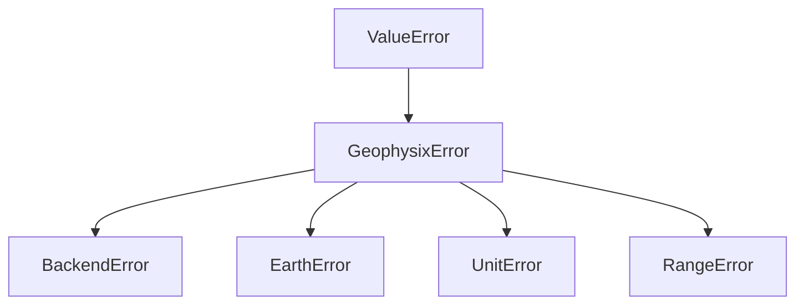

# Exceptions

Every error raised by the package derives from [`GeophysixError`][geophysix.GeophysixError], which is itself a `ValueError`.

```mermaid
graph TD
    V[ValueError] --> G[GeophysixError]
    G --> B[BackendError]
    G --> E[EarthError]
    G --> U[UnitError]
    G --> R[RangeError]
```

::: geophysix.exceptions
